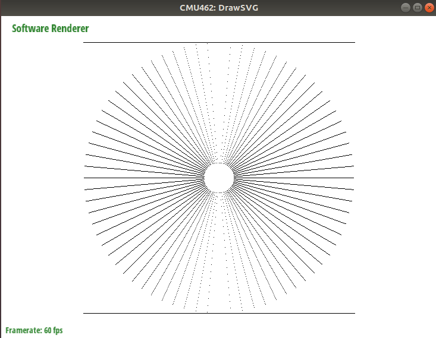
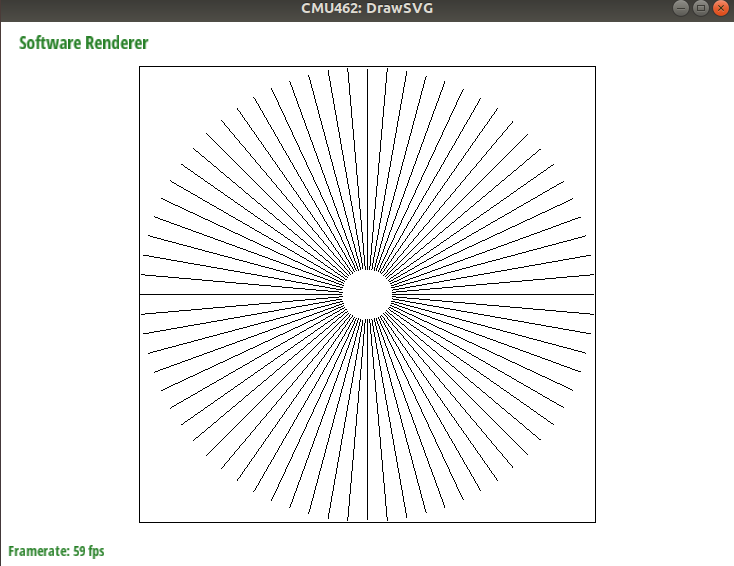

# cmu-462

15-462作业

- [cmu-462](#cmu-462)
  - [1  Draw SVG](#1--draw-svg)
    - [Task 1: Hardware Renderer](#task-1-hardware-renderer)
    - [Task 2 : Warm Up: Drawing Lines](#task-2--warm-up-drawing-lines)

## 1  Draw SVG

### Task 1: Hardware Renderer

使用opengl库光栅化图形

### Task 2 : Warm Up: Drawing Lines

在屏幕上画一条线，给出的参数如下：

```c++
rasterize_line(float x0, float y0,//点1
               float x1, float y1,//点2
               Color color)
```

直接的想法是算出斜率，然后从点1到点2每走一步画一个点，但这个方法在斜率大于1是会出现断线的情况，如下所示：



所以需要根据斜率调整绘制的步长，而且要保证x和y同时到达目标点，最终效果如下：



### Task 3 : Drawing Triangles

这里我们需要绘制三角形。

- 首先根据三个顶点坐标找到三角形的包围框
- 然后遍历其中每个采样点，判断其是否在三角形内部，若在，就绘制这个点。
- 判断方法：使用叉积，而且只用计算z方向的值，知道其正负即可

